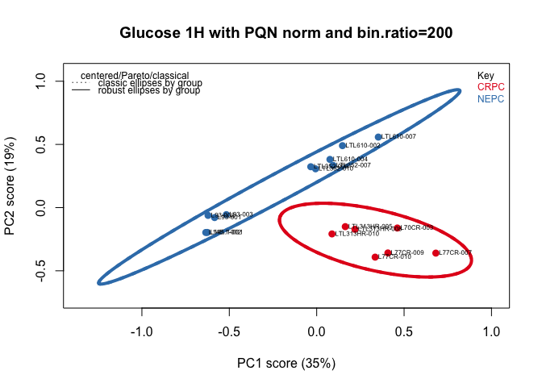
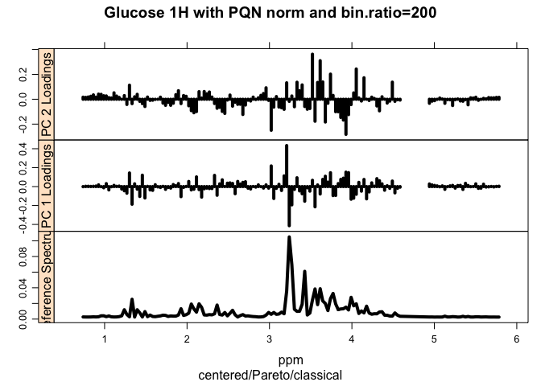
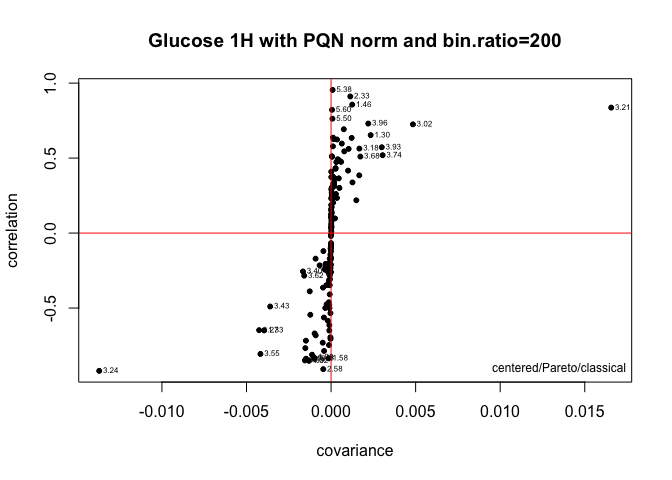
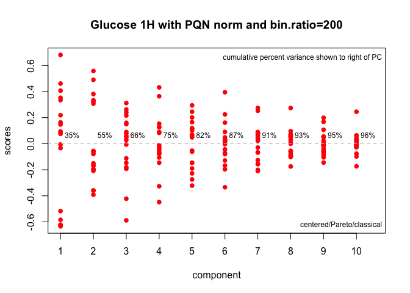

Comparision of LuCaP and LTL extracts using ChemoSpec
================
Jinny Sun

March 16, 2020

# Experiment Details

  - Models used: Prostate Cancer PDX models of castration-resistant
    prostate cancer (CRPC) and neuroendocrine prostate cancer (NEPC)
  - Spectra acquired: 1H presat and 13C-decoupled 1H presat spectra
  - Labeling method: \[U-13C\]glucose or \[U-13C\]glutamine labeled for
    45 min

# Analysis

## Load Packages

``` r
library(ChemoSpec)
library(R.utils)
library(R.oo)
library(R.methodsS3)
library(exCon)
library(RColorBrewer)
library(gplots)
library(baseline)
library(IDPmisc)
library(robustbase)
library(pls)
library(plyr)
```

## Load Data

``` r
# Glucose 1H Presat Data
Spectra <- files2SpectraObject(gr.crit = c("CRPC","NEPC"),sep=",",freq.unit="ppm",int.unit="A.U.",desc="[U-13C]glucose labeled 1H presat",out.file="glucose_1H_data") #Convert csv files to Spectra Objects in the current directory
```

``` r
Spectra <-removeSample(Spectra,rem.sam = c("L145.1-005_NEPC1_U13Cglucose_3")) #L145.1-005 was removed as it was an extreme outlier, may be because it was measured at 318K and with 48Hz CHIRP pulse
sumSpectra(Spectra) #summarize data set & verify data ranges
```

    ## 
    ##  [U-13C]glucose labeled 1H presat 
    ## 
    ##  There are 18 spectra in this set.
    ##  The y-axis unit is A.U..
    ## 
    ##  The frequency scale runs from
    ##  -0.345607 to 9.89847 ppm
    ##  There are 65536 frequency values.
    ##  The frequency resolution is
    ##  0.00016 ppm/point.
    ## 
    ## 
    ##  The spectra are divided into 2 groups: 
    ## 
    ##   group no.   color symbol alt.sym
    ## 1  CRPC   7 #E41A1C      0       a
    ## 2  NEPC  11 #377EB8      1       b
    ## 
    ## 
    ## *** Note: this is an S3 object
    ## of class 'Spectra'

``` r
myt <- "Glucose 1H with PQN norm and bin.ratio=200"
Spectra$names <- c("L145.1-001", "L145.1-002", "L70CR-003", "L77CR-007", "L77CR-009", "L77CR-010", "L93-001", "L93-002", "L93-003", "LTL313HR-005", "LTL313HR-008", "LTL313HR-010", "LTL352-007", "LTL352-008", "LTL352-010", "LTL610-002", "LTL610-004","LTL610-007")
```

## Process Spectra

The steps to process spectra include:

1.  Removing reference and solvent signals
2.  Normalize spectra using Probabalistic Quotient Normalization
3.  Bin spectra to reduce dimensionality

These steps are performed using the `removeFreq`, `normSpectra`, and
`binSpectra` functions.

``` r
Spectra.f <- removeFreq(Spectra, rem.freq = Spectra$freq > 5.8
                        | Spectra$freq < .7) # Remove frequencies from both ends at once
Spectra.f <- removeFreq(Spectra.f, rem.freq = Spectra.f$freq > 4.6
                        & Spectra.f$freq < 4.9) # Remove water
### Normalize Spectra
Spectra.f <- normSpectra(Spectra.f, method = "PQN") #Probabalistic Quotient Normalization

### Bin data - this helps compensate for chemical shifts in narrow peaks due to diltuion, ionic strength, pH, etc. Not a big deal for broad peaks.
tmp <- binSpectra(Spectra.f, bin.ratio = 200) #.03ppm bin size
```

    ## To preserve the requested bin.ratio,  149  data point(s)
    ## has(have) been removed from the beginning of the data chunk 1 
    ## 
    ## To preserve the requested bin.ratio,  158  data point(s)
    ## has(have) been removed from the beginning of the data chunk 2 
    ## 
    ## A total of 307 data points were removed to preserve the requested bin.ratio

``` r
sumSpectra(tmp)
```

    ## 
    ##  [U-13C]glucose labeled 1H presat 
    ## 
    ##  There are 18 spectra in this set.
    ##  The y-axis unit is A.U..
    ## 
    ##  The frequency scale runs from
    ##  0.7389826 to 5.784351 ppm
    ##  There are 152 frequency values.
    ##  The frequency resolution is
    ##  0.03126293 ppm/point.
    ## 
    ##  This data set is not continuous
    ##  along the frequency axis.
    ##  Here are the data chunks:
    ## 
    ##    beg.freq end.freq     size beg.indx end.indx
    ## 1 0.7389826 4.584323 3.845341        1      124
    ## 2 4.9402519 5.784351 0.844099      125      152
    ## 
    ##  The spectra are divided into 2 groups: 
    ## 
    ##   group no.   color symbol alt.sym
    ## 1  CRPC   7 #E41A1C      0       a
    ## 2  NEPC  11 #377EB8      1       b
    ## 
    ## 
    ## *** Note: this is an S3 object
    ## of class 'Spectra'

## Plot Spectra

``` r
### Classical & Robust PCA - outliers will contribute strongly to the variance of the entire data set ###
class.results <- c_pcaSpectra(tmp, choice = "Pareto")

plotScores(tmp, class.results, main = myt, pcs = c(1,2), ellipse = "both", tol = 1.0, lwd = 4)
```

<!-- -->

``` r
### Loading plots
loadingplot <- plotLoadings(tmp, class.results, main = myt, loads = c(1, 2), tol = 0.05, lwd = 4) #how many bootstraps are needed to reach 95% explained variance
```

<!-- -->

``` r
### sPlot: Plot correlation of each frequency variable with covariance. Most influencial variables are in the upper right & lower left quadrants
spt <- sPlotSpectra(tmp,class.results, main = myt, pc = 1, tol = 0.05, lwd = 1)
```

<!-- -->

``` r
### Scree plot
plotScree(class.results, main = myt, lwd = 4)
```

<!-- -->
